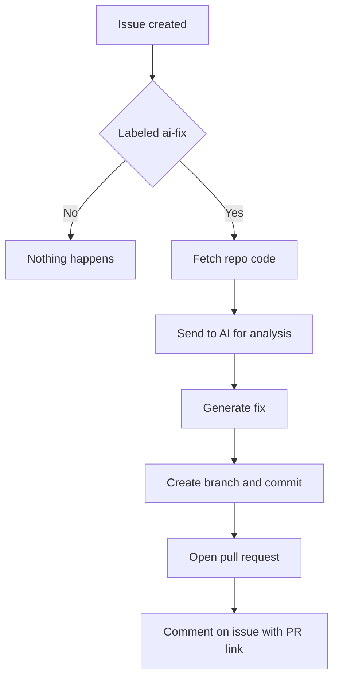

# Ghostfix

A GitHub App that reads your issues, looks at your code, and opens a PR with a fix. You label an issue, it does the rest.

## Why?

Most issues sit around waiting for someone to context-switch, read through the codebase, figure out what's wrong, and push a fix. That loop is slow. Ghostfix shortens it - label an issue `ai-fix`, and it picks it up, reads the relevant code, generates a patch, and opens a pull request. You still review and merge. It just removes the grunt work.

It won't replace you on hard architectural problems. But for straightforward bugs, typos, missing error handling, small feature asks - it gets surprisingly close.

## How it works



1. Someone opens an issue and adds the `ai-fix` label (or you add it later)
2. GitHub fires a webhook to your Ghostfix instance
3. Ghostfix pulls the repo tree, grabs relevant source files
4. Sends everything to an AI provider with the issue context
5. Parses the response, commits the changes to a new branch
6. Opens a PR that references and closes the original issue

## Supported AI providers

Use whichever you already have an API key for. Ghostfix picks the first one it finds:

| Provider | Env variable | Default model |
|----------|-------------|---------------|
| Anthropic (Claude) | `ANTHROPIC_API_KEY` | claude-sonnet-4-20250514 |
| Google Gemini | `GEMINI_API_KEY` | gemini-2.0-flash |
| OpenRouter | `OPENROUTER_API_KEY` | anthropic/claude-sonnet-4 |
| OpenAI | `OPENAI_API_KEY` | gpt-4o |
| Groq | `GROQ_API_KEY` | llama-3.3-70b-versatile |
| Together | `TOGETHER_API_KEY` | Llama-3.3-70B-Instruct-Turbo |

## Setup

### 1. Create a GitHub App

Go to [github.com/settings/apps/new](https://github.com/settings/apps/new) and configure:

- **Webhook URL**: Your server URL + `/webhook` (use ngrok for local dev)
- **Webhook secret**: Generate something random, save it for `.env`
- **Permissions**:
  - Repository: Contents (Read & Write), Issues (Read & Write), Pull requests (Read & Write)
- **Events**: Subscribe to `Issues`

Download the private key after creating the app.

### 2. Install and run

```bash
git clone https://github.com/Nixxx19/ghostfix.git
cd ghostfix
npm install
```

Copy `.env.example` to `.env` and fill in your values:

```bash
cp .env.example .env
```

```env
GITHUB_APP_ID=123456
GITHUB_PRIVATE_KEY_PATH=./private-key.pem
GITHUB_WEBHOOK_SECRET=your-secret
ANTHROPIC_API_KEY=sk-ant-...
```

Then run it:

```bash
npm run dev
```

### 3. Expose locally (for development)

```bash
ngrok http 3000
```

Copy the ngrok URL into your GitHub App's webhook settings.

### 4. Try it out

Install the app on a repo, open an issue, slap the `ai-fix` label on it, and watch.

## Configuration

| Variable | Required | Description |
|----------|----------|-------------|
| `GITHUB_APP_ID` | Yes | Your GitHub App ID |
| `GITHUB_PRIVATE_KEY_PATH` | Yes | Path to the `.pem` file |
| `GITHUB_WEBHOOK_SECRET` | Yes | Webhook secret you set in the app |
| `TRIGGER_LABEL` | No | Label that triggers the bot (default: `ai-fix`) |
| `PORT` | No | Server port (default: `3000`) |

Plus one AI provider key (see table above).

## Limitations

- Works best on small-to-medium repos. Very large codebases may hit token limits.
- The fix quality depends on the AI model and how well the issue is described.
- It reads up to 40 source files. If the relevant code is buried deep, it might miss context.
- Always review the PR before merging. Always.

